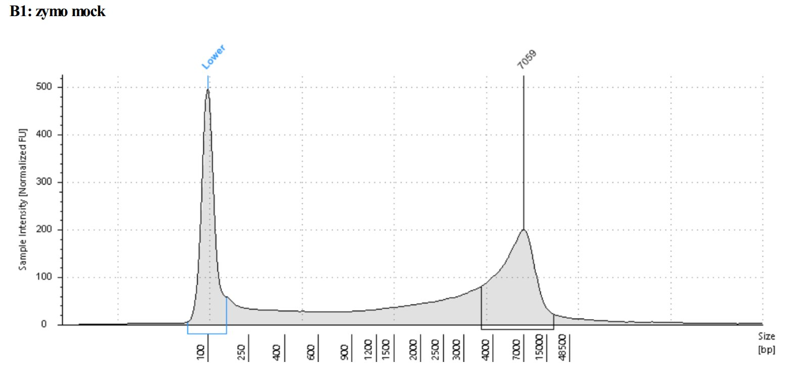
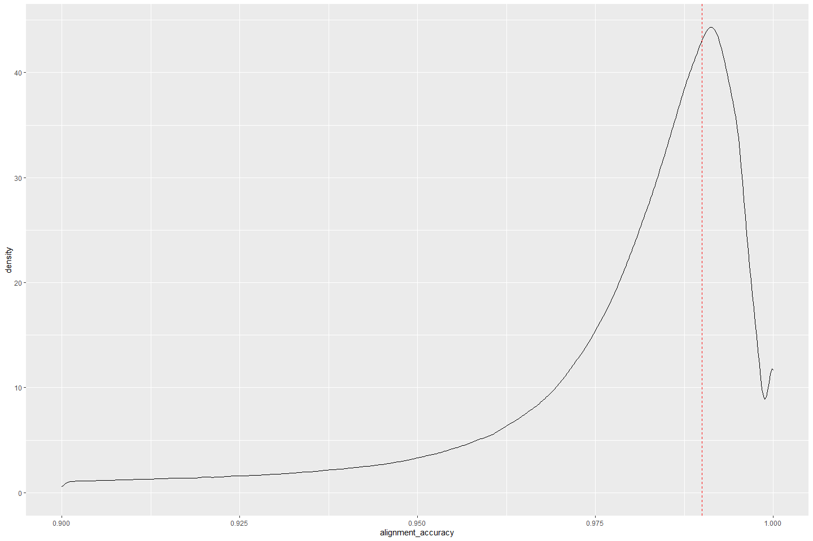
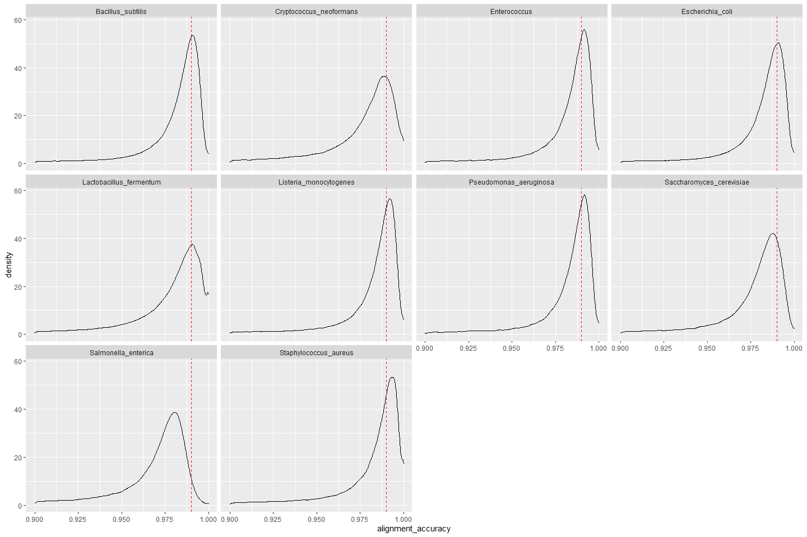
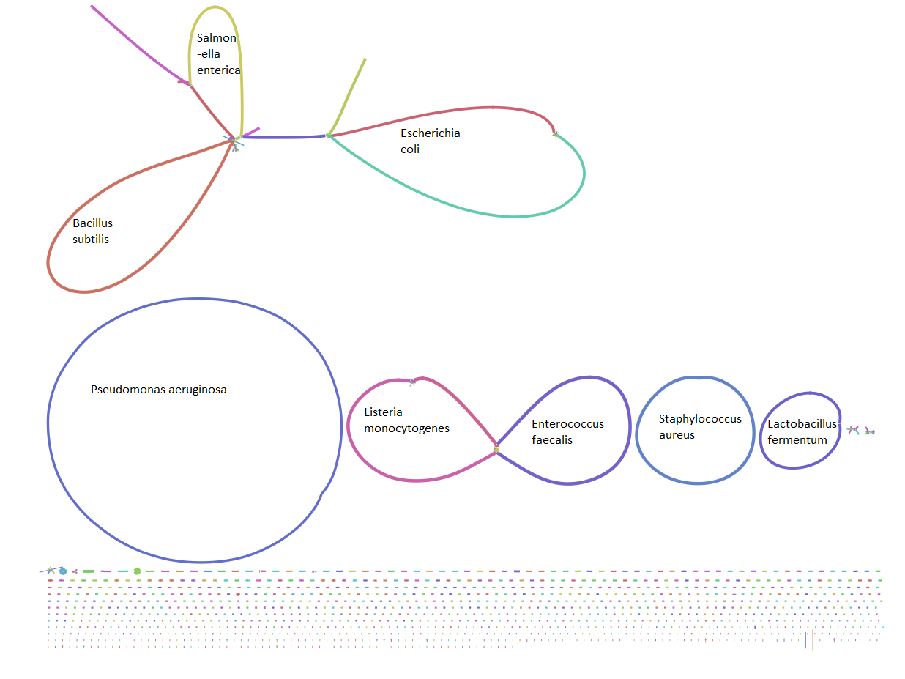
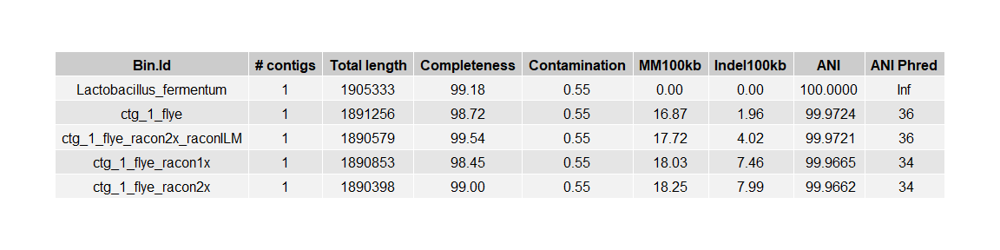
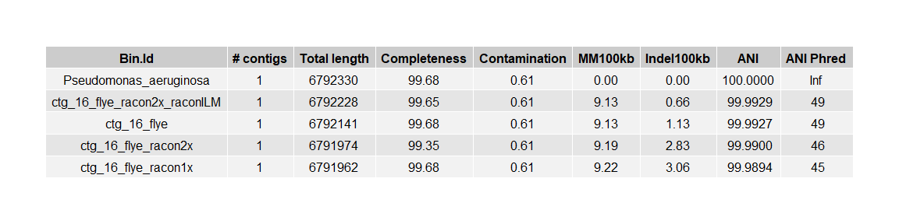
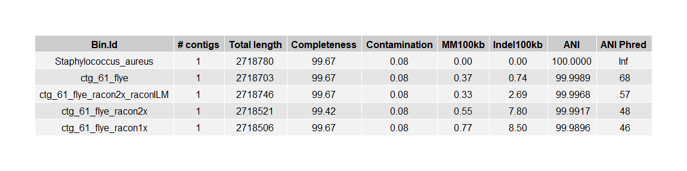
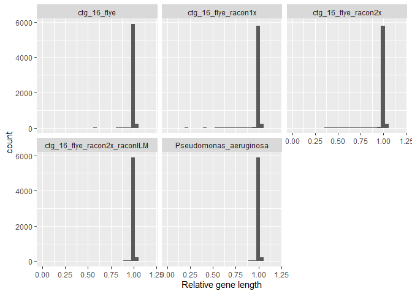
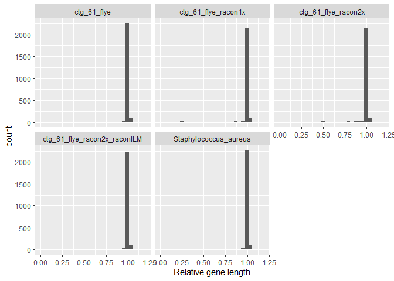

README
================
Rasmus Kirkegaard
20 May, 2021

# Can nanopore really produce Q20 quality single pass reads?

We were lucky to be offered to try the new “Q20” chemistry ahead of the
wide release. This post shows what the data looked like at the time we
got it and might not reflect the performance when the kit enters a wide
release as basecalling algorithms etc might have been fine tuned in the
meantime. The main selling point with this chemistry+bonito basecalling
was improved single pass accuracy. To evaluate the accuracy we sequenced
the zymo mock community where a known reference genome is available for
all of the organisms so it is possible to determine how well the
basecalled reads reflect the genomes. The sequencing was carried out on
the Promethion P24 platform with the Zymo mock DNA directly from
supplier without any pretreatment (no short read elimination). The DNA
fragments have a peak around 7 kbp but with a tail of short fragments.
To maximise yield the short fragments would ideally have been removed
but since the DNA material was limited I omitted this as I figured that
a Promethion Flowcell would anyway generate plenty of data to check the
quality of the reads for this low complexity sample.

# Conclusion - YES!

Yes the overall modal alignment accuracy was already 99 % with this
release when tested with the zymo mock community. There are still some
species specific variations but the read quality is generally really
good. The best chromosome contig recovered had an indel rate of
0.74/100kbp and mismatch rate of 0.37/100kbp, which is pretty mind
blowing for a nanopore only assembly!!! The estimated ANI value was
99.9989 %! Polishing this metagenome assembly with racon did not seem to
improve the quality of the best contig. A medaka model was not available
and will likely be tricky to develop for contigs with this quality
directly from the assembler. I assume that improvements in the
basecalling models will bring the others on par with this in the future.

# Data availability

I have uploaded the basecalled data and the fast5 files to the ENA
[PRJEB43406](https://www.ebi.ac.uk/ena/browser/view/PRJEB43406). For
illumina data I grabbed the reads from [Lomans mock community
blogpost](https://lomanlab.github.io/mockcommunity/).

------------------------------------------------------------------------

# DNA input size distribution

The DNA size distribution was checked using a genomic screentape.

# Basecalling with bonito (v. 0.3.5)

The reads were basecalled using bonito (v. 0.3.5) with a model
specifically trained for this new type of data.

## Overall alignment accuracy

The modal alignment accuracy (reported by bonito) seems to be better
than 99 % (Q20) from reading single DNA molecules!!! So the chemistry
clearly delivers excellent performance on accuracy.

<!-- -->

## Alignment accuracy pr genome

Since the zymo includes a number of different organisms it would be
interesting to see if the performance was equally good for all
organisms. The alignment accuracy distributions seems indicate that the
basecalling is slightly better for some organisms than others. For many
of the organisms the peak of the distribution is slightly higher than 99
% but for e.g. Salmonella Enterica the performance seems to be a bit
lower. The models for basecalling are likely going to be improved before
a wide release but it is important to keep in mind that your favourite
pet organisms might have modifications that are not yet included in the
basecalling models and thus show lower performance.

<!-- -->

# Genome assembly overview

While it is great to see improvements of the single read accuracy. It is
also interesting to see how the consensus accuracy is improving. To do
this I ran and assembly with metaflye (v. 2.8.3-b1695) inputting the
reads as –nano-corr and three of the chromosomes assembled into nice
circular contigs even with the “short” DNA fragments from the zymo
library. Here the assembly graph is visualised using bandage. I used the
three chromosomes for comparison

## Lactobacillus fermentum

<!-- -->

## Pseudomonas aeruginosa

<!-- -->

## Staphylococcus aureus

<!-- -->

# IDEEL analyses (<https://github.com/mw55309/ideel>)

To ensure that indel errors left from the nanopore data do not cause
genes to break we can compare the gene length with that of the best hit
to a reference gene. Most genes appear to have a length that is similar
to the best “BLAST” (DIAMOND) hit in the reference database indicated by
a relative gene length of 1.

### Lactobacillus fermentum - How many of the genes are full length?

<!-- -->

### Pseudomonas aeruginosa - How many of the genes are full length?

<!-- -->

### Staphylococcus aureus - How many of the genes are full length?

<!-- -->
